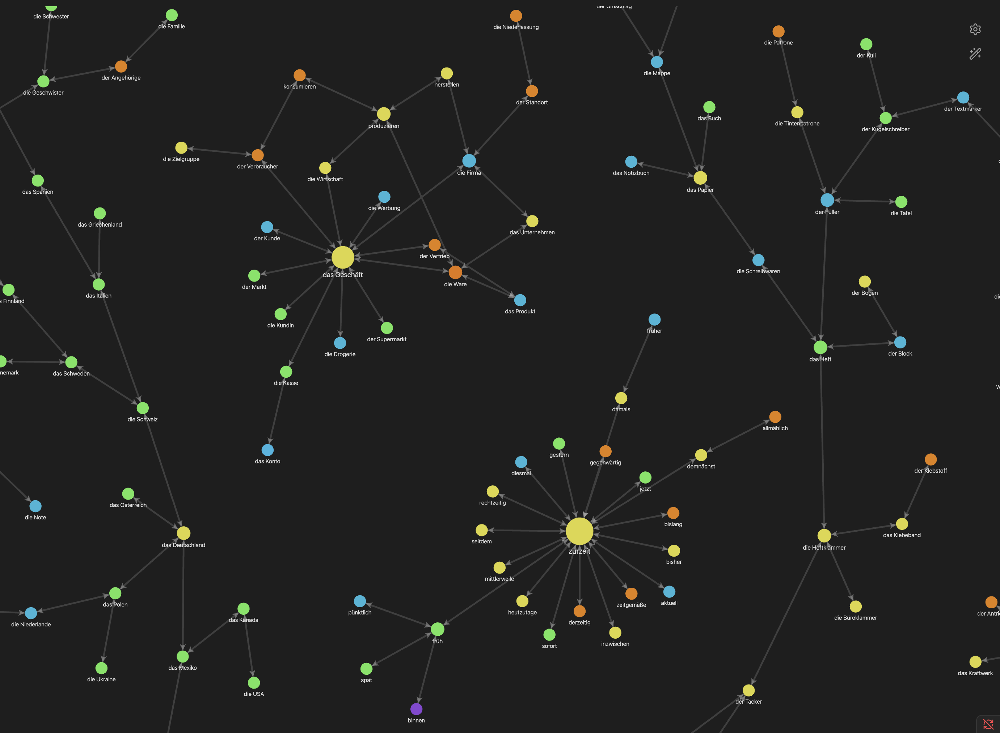

# Wortschatz

A Claude Code skill that maintains a German vocabulary knowledge graph in an Obsidian vault. Each note holds one word or expression, tagged with a CEFR level from A1 to C2 and documented with Turkish and English meanings, a simple German explanation, grammar notes, common patterns, and example sentences. A staged pipeline computes the semantic links between notes; nothing in the graph layer is written by hand.

## How it works

New vocabulary passes through six stages. Each stage runs only when the user asks for it by name.

1. ADD creates the notes. They start fully isolated, with no links to the rest of the vault.
2. MATCH embeds each new word with `intfloat/multilingual-e5-large` and writes reciprocal links between batch words whose cosine similarity reaches 0.90.
3. PARTITION runs hierarchical Leiden community detection on the batch graph and subdivides any community larger than 25 nodes.
4. ISOLATE deletes every edge that crosses a community boundary.
5. PRUNE breaks triangles inside each community into chains, keeping the path through the node nearest the community center.
6. VALIDATION reports likely duplicates, such as a plural form saved as its own note or two spellings that differ by one character.

The vault stays flat. There are no hub notes and no fixed taxonomy. Community membership is discovered per batch and stored on each note as a `Community: BATCH_<centerword>` label. A small set of protected classes (countries, body parts, weekdays and similar closed sets) is kept together through a sparse backbone of same-class links instead of being split by Leiden.

The Obsidian graph view below shows the result. Each island is one community, such as the shopping cluster around `das Geschäft`, the time adverbs around `zurzeit`, the stationery cluster around `das Heft`, and the country backbone on the left. Colors mark CEFR levels.



## Installation

```bash
git clone <repo-url> ~/.claude/skills/wortschatz
pip install -r ~/.claude/skills/wortschatz/scripts/requirements.txt
export WORT_VAULT=/path/to/WORT/words
```

Add the export line to your shell profile so it persists, then type `/wortschatz` in Claude Code.

## Configuration

| Variable | Required | Purpose |
|---|---|---|
| `WORT_VAULT` | yes | Absolute path to the Obsidian `words/` folder |
| `WORT_ALLOW_MODEL_DOWNLOAD` | first run only | Set to `1` to permit downloading the embedding model |
| `WORT_EMBEDDING_PROVIDER` | no | `ollama`, `openai`, `lmstudio`, or `http` to use a served model instead |
| `WORT_EMBEDDING_API_URL` | no | Endpoint for the served model |
| `WORT_EMBEDDING_MODEL` | no | Model name at that endpoint |
| `WORT_EMBEDDING_API_KEY` | no | Key for OpenAI-compatible servers |

The default backend loads the embedding model locally through sentence-transformers. If you use a served model instead, `sentence-transformers` and `faiss-cpu` can be dropped from the requirements. Embedding cache files (`.json`, `.npy`, `.faiss`) are written to the parent directory of the `words/` folder, never into this repository.

## Repository layout

```
SKILL.md                     the skill definition Claude Code loads
scripts/
  match_batch.py             stage 2: intra-batch semantic linking
  partition_batch.py         stage 3: hierarchical Leiden communities
  isolate_communities.py     stage 4: cut cross-community edges
  prune_triangles.py         stage 5: break triangles into chains
  validate_vault.py          stage 6: duplicate and typo detection
  reset_graph.py             maintenance: clear the graph layer
  vault_parser.py            shared parsing; resolves WORT_VAULT
  embedding_cache.py         embedding backends and on-disk cache
  graph_hints.py             protected closed-class definitions
  build_semantic_edges.py    embedder and text helpers
  requirements.txt           Python dependencies
```

Scripts import each other by module name, so run them from inside `scripts/`. All of them abort with an explanatory error if `WORT_VAULT` is unset or does not point at a directory.

## Vault data

The vault itself is personal data and is excluded from this repository. Sync it separately, for example through Obsidian Sync or iCloud. If the graph layer needs to be rebuilt, `reset_graph.py` clears the links of every note while preserving the lexical content; it performs a dry run unless called with `--apply`.
